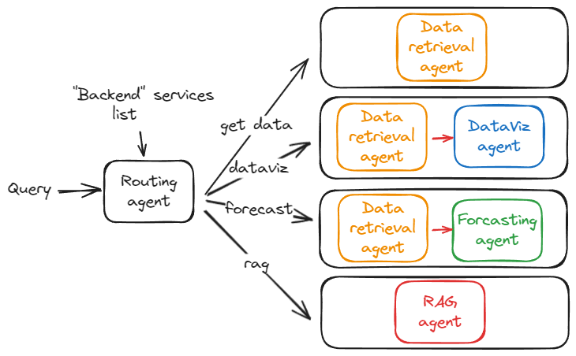
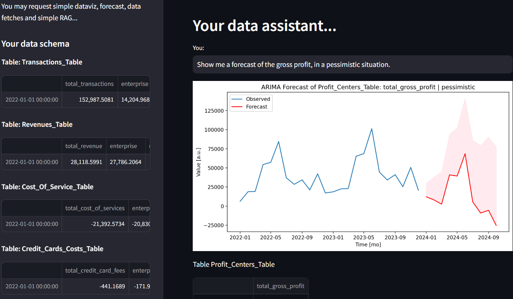

# NlpCaseStudy

___
## Features
You may send a text query to a routing LLM agent.
Queries may relate to financials and accounting questions or actions to be taken on accounting
data (e.g, forecasting, data visualization...).
This agent will then choose which action to undertake and call the relevent services.

The services are implemented "as if" they were an external API.
My hope being that it would somewhat feel like a POC of the current Pigment's system.


Currently, the agent can call the following services:
- RAG Agent: a simple RAG on the provided .pdf document has been implemented.
- Data Retrieval Agent: a barebone query engine has been developped to give you access to the .xlsx data.
**This data is stored in various dataframe as if it were a company database with multiple
  datables.**
- Data Visualisation Agent: you may request simple data visualisation such as time-series plots, pie
  charts or histograms.
- Data Forecasting Agent: you may request the agent to perform an ARIMA forecast on a particular set
  of data.

Some services use LLMs, other may use an Embedder.
Some services are dependent on other services. E.g., the Data Visualization service uses
the Data Retrieval in order to fetch the data from our mock database.
This is all done by chaining services as if they were part of a pipeline.

This architecture is somewhat scalable as you may simply develop more services and create more
pipelines.

|  |
|:--------------------------------------------------------------------------:|
|          Example of routing and pipeline activation by the agent.          |

___
## Where to start ? How to use this repo ?
Clone this repo:
```
git clone XXX
```
Create a ```Python 3.11``` environement and install the project's dependencies by running:
```
pip install -r env/requirements_dev.txt
```

The simplest way to interact with the project is to use its Streamlit entry. In a terminal, from
the repo's root run:
```
streamlit run streamlit_app.py
```
A simple chatbot UI will then be displayed at your localhost.

|  |
|:-----------------------------------------------------------------------:|
|        A simple UI to interact with your tabular and text data.         |


If you want more details on how the data is prepared and consummed you will find 3 notebooks at
the repo's root:
- ```00_TabularData_Preparation```: a simple data sanitization notebook. This
  notebook explores the provided Excel file and showcases how to split it into multiple
  dataframe to create the mock database.
- ```01_TextData_Preparation```: this notebook showcases the descision making behind the parsing,
  chunking and vectorization of the provided Pdf file.
- ```02_Features_Showcase```: notebook explaining how to use the features of this repo.

___
## Contribution
To contribute to this repository, please install and apply [`pre-commit`](https://pre-commit.com/) hooks before each commit.
```shell
pip install pre-commit
pre-commit install
pre-commit run --all-files
```
Note:
- Formatter/Linter used in this repo is "Ruff". Rules are set in the pyproject file.
Please install and set Ruff as your IDE formatter to comply with the repo's standard.
- Commit messages should follow the [`conventionnal commit standard`](https://www.conventionalcommits.org/en/v1.0.0/)
- The Bunka library is quite new and has tons of dependencies, the pip install might be long...

## Secrets
LLM/Embedders API-keys must be stored in a ```core/settings/secrets.env``` file.
This file is not pushed in version control (git-ignored).
Please ask Antoine Garçon for that file if you wish to use those APIs.
If you wish to use your own secrets an example is provided.
